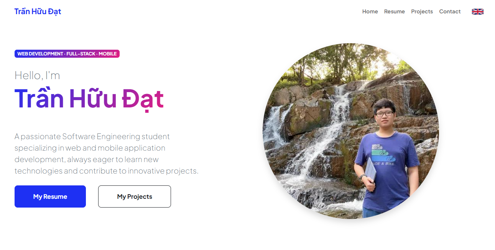

# Trần Hữu Đạt - Personal Portfolio & Project Showcase

 <!-- THAY THẾ bằng ảnh chụp màn hình trang chủ portfolio của bạn -->

Welcome to the source code repository for my personal portfolio website! This site serves as a central hub to showcase my skills, projects, and professional resume. It's designed with a clean, responsive interface and enhanced with interactive elements to provide an engaging user experience.

**🚀 Live Portfolio:** [https://tranhuudat2004.github.io/](https://tranhuudat2004.github.io/) <!-- Cập nhật link nếu khác -->

## ✨ Key Features

This portfolio website incorporates several key features:

*   **Comprehensive Multi-Page Layout:**
    *   **🏠 Home (`index.html`):** A welcoming landing page introducing myself, highlighting key skills through an interactive grid, and providing an overview of my capabilities.
    *   **📄 Resume (`resume.html`):** A detailed presentation of my professional experience, educational background, and notable achievements.
    *   **💡 Projects (`projects.html`):** A categorized showcase of my software development projects, complete with descriptions, tech stacks, and direct links to live demos and GitHub repositories. This page dynamically fetches project data from the GitHub API.
    *   **✉️ Contact (`contact.html`):** A user-friendly contact form (powered by SB Forms - *API token setup required for full functionality*) alongside direct contact information.
*   **🖱️ Interactive Custom Cursor:** A unique, custom-designed mouse cursor that follows user movement across all pages. It features dynamically cycling text (with fade-in/fade-out animations) that is **contextually tailored to each specific page** (Home, Resume, Projects, Contact), offering relevant greetings or information. The cursor also changes appearance when hovering over interactive elements.
*   **🌐 Bilingual Support (English/Vietnamese):** Users can seamlessly switch website content between English and Vietnamese using an intuitive language switcher located in the navigation bar. Language preferences are saved locally for a consistent experience.
*   **📱 Responsive Design:** Built with Bootstrap 5, ensuring the website adapts beautifully and functions optimally across various screen sizes, including desktops, tablets, and mobile devices.
*   **🛠️ Interactive Skills Display:** Technical skills are presented in an engaging, interactive grid format on the Home and Resume pages, where hovering reveals more information via the custom cursor.

## 🛠️ Technology Stack

This portfolio is built using a combination of modern front-end technologies:

*   **HTML5:** Semantic markup for structuring the content of all pages.
*   **CSS3:** Custom styling for visual appeal, layout management (Flexbox, Grid), and animations.
    *   **Bootstrap 5:** Leveraged for its robust responsive grid system, pre-styled UI components, and utility classes.
*   **JavaScript (ES6+):** Powers all dynamic functionalities:
    *   **Custom Cursor Logic:** Manages cursor movement, text cycling with fade effects, and context-aware text display (embedded CaCl HMTL page).
    *   **Bilingual System:** Dynamically loads and applies language translations to page content.
    *   **GitHub API Integration (`js/github.js`):** Fetches and renders project information on the "Projects" page.
    *   **UI Interactions:** Handles events for the language switcher, interactive grids, and other dynamic elements.
*   **External Libraries & APIs:**
    *   [Bootstrap Icons](https://icons.getbootstrap.com/)
    *   [Google Fonts (Plus Jakarta Sans)](https://fonts.google.com/specimen/Plus+Jakarta+Sans)
    *   [SB Forms](https://startbootstrap.com/solution/contact-forms) (for the contact form - *API token required*)
    *   [GitHub API](https://docs.github.com/en/rest) (for project data)
*   **Hosting:** Deployed as a static website via [GitHub Pages](https://pages.github.com/).

## 📂 Project Structure


## 🚀 How to View / Local Setup

1.  **Live Site:**
    *   The portfolio is best viewed live at: [https://tranhuudat2004.github.io/](https://tranhuudat2004.github.io/)

2.  **Local Setup:**
    *   Clone this repository:
        ```bash
        git clone https://github.com/TranHuuDat2004/tranhuudat2004.github.io.git
        ```
        *(Replace with your actual repository URL if it's different)*
    *   Navigate into the cloned directory:
        ```bash
        cd tranhuudat2004.github.io
        ```
    *   Open any of the `.html` files (e.g., `index.html`) directly in your preferred web browser. No compilation or build steps are necessary as this is a static website.

    *   **Important Note for Contact Form:** The contact form on `contact.html` uses SB Forms. For it to send emails, you must:
        1.  Sign up at [https://startbootstrap.com/solution/contact-forms](https://startbootstrap.com/solution/contact-forms).
        2.  Obtain your unique API token.
        3.  Replace the placeholder `API_TOKEN_CUA_BAN` in the `data-sb-form-api-token` attribute of the `<form>` tag in `contact.html` with your actual token.

## 💡 Development Insights & Customizations

*   **Contextual Cursor Text:** The custom cursor's text changes based on the page being viewed, providing relevant, cycling messages (e.g., greetings on the homepage, skill-related info when hovering over skill tags). This is achieved by defining unique `autoTexts` arrays within the JavaScript embedded in each HTML page.
*   **Dynamic Language Switching:** A JavaScript-driven system allows users to toggle between English and Vietnamese content. Translations are stored in a JS object, and the DOM is updated dynamically. The selected language is persisted in `localStorage`.
*   **GitHub Projects Showcase:** The `projects.html` page leverages the GitHub API via `js/github.js` to automatically fetch and display my public repositories as interactive project cards, keeping the project list up-to-date.

## 🌟 Future Enhancements (Ideas)

*   Implement a dark mode/light mode toggle.
*   Add a dedicated blog section.
*   Further optimize image loading for even faster performance.
*   Explore more advanced animations or micro-interactions.

## 👤 Author & Contact

*   **Trần Hữu Đạt**
    *   **GitHub:** [@TranHuuDat2004](https://github.com/TranHuuDat2004)
    *   **LinkedIn:** [linkedin.com/in/tranhuudat2004](https://linkedin.com/in/tranhuudat2004) <!-- Cập nhật link đầy đủ -->
    *   **Email:** `huudat.peashooer@gmail.com`

---

<p align="center">
  Thank you for exploring my portfolio and its source code! Feel free to connect.
</p>